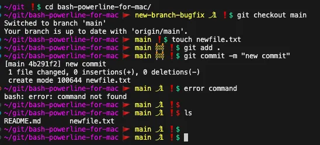

# Elevate Your Terminal: A Stylish Guide to Lightweight and Colorful Bash Powerline on Mac



:bangbang: Blog post on Medium: [Elevate Your Terminal: A Stylish Guide to Lightweight and Colorful Bash Powerline on Mac](https://medium.com/@karen.haryan/elevate-your-terminal-a-stylish-guide-to-lightweight-and-colorful-bash-powerline-on-mac-7b463d79c2f2). :bangbang:

## Introduction

Welcome to the world of sleek and powerful terminal customization on your Mac!
In this guide, we’ll explore the art of installing a lightweight, colorful, and undeniably cool Powerline setup to transform your terminal experience. 
From tweaking your bash profile to customizing Powerline configurations, we’ve got you covered. Let’s dive in!

## Prerequisites

Before you begin, ensure that you have the following installed:

- Homebrew

## Installation

### Section 1: Getting Started

#### Installing Requirement Packages:

Install powerline and optional hstr.

```
pip3 install powerline-status
brew install hstr
```

### Section 2: Setting the Foundation

### Adding the Bash Profile:

Sometimes, the simplest things make the biggest impact.
In this case, adding a bash profile is the key to unlocking the full potential of your terminal.
We’ll guide you through the process of creating and adding this file if it’s not already present.

Edit bash_profile file, or copy bash_profile file to ~/.bash_profile

```
vi ~/.bash_profile
```

**Note!** Mac doesn’t come with bash_profile file, since by default it`s using zsh. You might have empty file.

Comment out extras if you need them, and add below code into your bash profile.

```
source ~/.bash_powerline.sh
eval "$(/opt/homebrew/bin/brew shellenv)"

# Extra's
# run DD in your project repository to delete all branches except main
# Note! change it if your main branch name is different

#alias DD='git branch | grep -v "main" | xargs git branch -D'

# run GD in your project repository to checkout to main, run git pull, delete all branches except main
# Note! change it if your main branch name is different

#alias GD='git checkout main && git pull && DD'
```

### Section 3: Powering Up with Powerline

#### Example Bash Powerline Config:
N
ow that our foundation is set, let’s sprinkle some magic with Powerline configurations.
Below is a sneak peek into a captivating bash Powerline setup that will not only enhance your productivity but also make your terminal a work of art.

Add powerline script, or copy bash_powerline.sh to ~/.bash_powerline.sh

```
vi ~/.bash_powerline.sh
```

Add powerline bash config.

```
#!/usr/bin/env bash

## Uncomment to disable git info
#POWERLINE_GIT=0

powerline() {
    # Colors
    COLOR_RESET='\[\033[38;5;15m\]'
    COLOR_CWD=${COLOR_CWD:-'\[\033[38;5;201m\]'} # yellow
    COLOR_GIT=${COLOR_GIT:-'\[\033[38;5;11m\]'} # git
    COLOR_FAILURE=${COLOR_FAILURE:-'\[\033[38;5;196m\]'} # red
    COLOR_SUCCESS=${COLOR_SUCCESS:-'\[\033[38;5;10m\]'} # green


    # Symbols
    SYMBOL_GIT_BRANCH=${SYMBOL_GIT_BRANCH:-🚩}
    SYMBOL_GIT_MODIFIED=${SYMBOL_GIT_MODIFIED:- 🚧}
    SYMBOL_GIT_PUSH=${SYMBOL_GIT_PUSH:-⤴}
    SYMBOL_GIT_PULL=${SYMBOL_GIT_PULL:-⤵}

    if [[ -z "$PS_SYMBOL" ]]; then
      case "$(uname)" in
          Darwin)   PS_SYMBOL='❗$';;
          Linux)    PS_SYMBOL='❗$';;
          *)        PS_SYMBOL='%';;
      esac
    fi

    git_info() { 
        [[ $POWERLINE_GIT = 0 ]] && return # disabled
        hash git 2>/dev/null || return # git not found
        local git_eng="env LANG=C git"   # force git output in English to make our work easier

        # get current branch name
        local ref=$($git_eng symbolic-ref --short HEAD 2>/dev/null)

        if [[ -n "$ref" ]]; then
            # prepend branch symbol
            ref=$SYMBOL_GIT_BRANCH\ $ref
        else
            # get tag name or short unique hash
            ref=$($git_eng describe --tags --always 2>/dev/null)
        fi

        [[ -n "$ref" ]] || return  # not a git repo

        local marks

        # scan first two lines of output from `git status`
        while IFS= read -r line; do
            if [[ $line =~ ^## ]]; then # header line
                [[ $line =~ ahead\ ([0-9]+) ]] && marks+=" $SYMBOL_GIT_PUSH${BASH_REMATCH[1]}"
                [[ $line =~ behind\ ([0-9]+) ]] && marks+=" $SYMBOL_GIT_PULL${BASH_REMATCH[1]}"
            else # branch is modified if output contains more lines after the header line
                marks="$SYMBOL_GIT_MODIFIED$marks"
                break
            fi
        done < <($git_eng status --porcelain --branch 2>/dev/null)  # note the space between the two <

        # print the git branch segment without a trailing newline
        printf " $ref$marks"
    }

    ps1() {
        # Check the exit code of the previous command and display different
        # colors in the prompt accordingly. 
        if [[ $? -eq 0 ]]; then
            local symbol="$COLOR_SUCCESS $PS_SYMBOL $COLOR_RESET"
        else
            local symbol="$COLOR_FAILURE $PS_SYMBOL $COLOR_RESET"
        fi

        local cwd="$COLOR_CWD\w$COLOR_RESET"
        # Bash by default expands the content of PS1 unless promptvars is disabled.
        # We must use another layer of reference to prevent expanding any user
        # provided strings, which would cause security issues.
        # POC: https://github.com/njhartwell/pw3nage
        # Related fix in git-bash: https://github.com/git/git/blob/9d77b0405ce6b471cb5ce3a904368fc25e55643d/contrib/completion/git-prompt.sh#L324
        if shopt -q promptvars; then
            powerline_git_info="$(git_info)"
            local git="$COLOR_GIT\${powerline_git_info}$COLOR_RESET"
        else
            # promptvars is disabled. Avoid creating unnecessary env var.
            local git="$COLOR_GIT$(git_info)$COLOR_RESET"
        fi

        PS1="$cwd$git$symbol"
    }

    PROMPT_COMMAND="ps1${PROMPT_COMMAND:+; $PROMPT_COMMAND}"
}

powerline
unset powerline
```

Set Powerline configuration to be executable.

```
chmod +x ~/.bash_powerline.sh
```

### Section 4: Making the Switch

#### Changing System Default from Zsh to Bash:

For those who prefer the classic bash over zsh, we’ve got you covered. Learn how to effortlessly switch your system default shell to bash, ensuring a seamless transition and a familiar environment.

```
chsh -s /bin/bash
```

You’ll have to enter your user account’s password. Finally, close the Terminal window and reopen it. You’ll be using Bash instead of Zsh.

### Section 5: Tailoring VSCode to Your Style

#### Integrating Powerline with Visual Studio Code:

Extend the elegance of Powerline into your coding sanctuary. We’ll guide you through the steps of integrating Powerline into Visual Studio Code, creating a cohesive and stylish development environment.

Open VScode
Press Command+Shift+p | ⌘⇧P and search for terminal select default shell
Make your selection and press enter (In my case I chose `bash`)

All of your new terminals will now default to your choice 🎉

### Section 6: Beyond the Basics
#### Exploring Additional Customization's:

But wait, there’s more! Take your terminal aesthetics to the next level by exploring additional customization's.
We’ll briefly touch on extending Powerline with tmux and other enhancements to truly make your terminal stand out.

## Conclusion

Congratulations! You’ve successfully transformed your Mac terminal into a powerhouse of style and functionality. Embrace the beauty of Powerline, customize it to your heart’s content, and let your terminal become a reflection of your unique coding journey.

Now, go forth and code boldly with your newly adorned and vibrant terminal! 🚀✨

